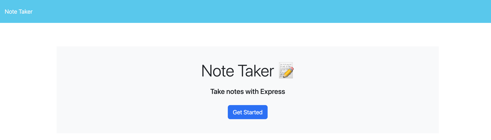
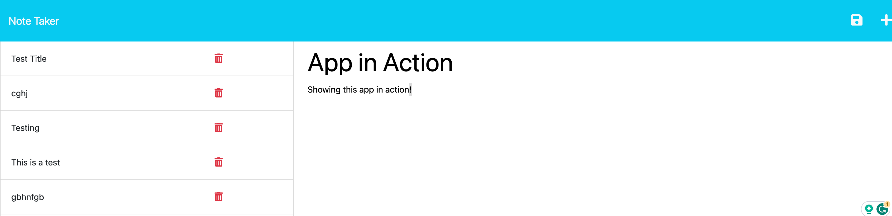

# Express.js-Note-Taker

 ## Table of Contents
 - [Project Description](#Description)
 - [Usage](#Usage)
 - [Installation](#Installation)
 - [Contribution](#Contribution)
 - [GitHub](#GitHub)
 - [Email](#Email)
 - [License](#License)
  
## Description
This application that allows the user to take notes and save them which will be located in the db.json file. How I completed this challenge was I first created the different route files- api & html. The reason for this was to not clutter up my server.js file and seperate things. The reason for this is from one of our classes and the instructor recommended this to be the best practice moving forward to use, that way the server.js is not doing everything but instead things are spread out making it easier to understand and work with moving forward.

Once I got the server.js and the route files set up I went and created a store.js file which contained a store class for all of the functionality needed for the application such as adding a note and deleting a note. This was all from advice from my study group member Chelsea whom was recommended this from her tutor to make things much easier and free up space that would be taken in the api.js file. Again, trying to seperate things out to not clutter up the code for the application.

I also installed the npm package uuid to be able to generate a random ID for every note saved, this way every note saved is unique and easily identifiable from the ID.

## Usage
When using the application click on the "Get Started" button. Then, You will be able to input the title of the note and then the body of information you owuld like to remember. Once you have entered your desired information you can then click the save icon and the note will be saved and you will be able to repeat the process.
## Technologies
Node.js, Express.js, JavaScript
## Installation
Install Node.js & Express.js
## Contribution
Currently there are no contributions being taken.
## Resources
Deployed Application:
https://notetaker-cms.herokuapp.com/

Screenshots:

Blog post for the different status codes and their meaning:
https://www.softwaretestinghelp.com/rest-api-response-codes/

link to routing site that helped me get the routing correct:
https://expressjs.com/en/guide/routing.html

Was assisted by fellow student Chelsea Luevano when creating this application.

Also was assisted by tutor Dru Sanchez
## GitHub
Christianmsm: https://github.com/Christianmsm
## Email
hello@itschristiansmith.com
## License
Licensed with: https://opensource.org/license/mit/